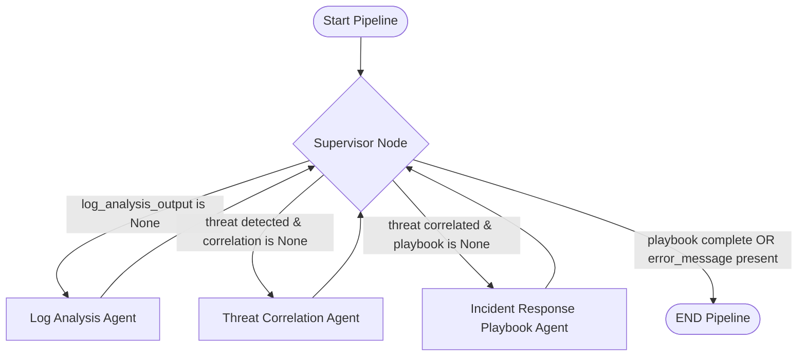

# 🛡️ Agentic Cybersecurity Threat Advisor

An advanced, AI-driven incident response automation system built on a multi-agent graph architecture orchestrated by **LangGraph**. This system acts as an intelligent assistant for security operations teams, performing automated log analysis, threat intelligence correlation, dynamic incident response playbook generation, compliance reporting, and interactive dashboarding.

The system is implemented and documented in the Jupyter Notebook [V2_Agentic_Cybersecurity_Threat_Advisor.ipynb](file:///c:/Users/kk/Documents/GAI-IIIT/cybersecurity/V2_Agentic_Cybersecurity_Threat_Advisor.ipynb).

---

## 📖 Table of Contents
1. [Project Overview & Objectives](#-project-overview--objectives)
2. [System Architecture & Workflow](#-system-architecture--workflow)
3. [Technology Stack](#-technology-stack)
4. [Deep Dive into Code Components](#-deep-dive-into-code-components)
    - [Knowledge Base & Ingestion Setup](#1-knowledge-base--ingestion-setup)
    - [Strict Data Formats (Pydantic)](#2-strict-data-formats-pydantic)
    - [Agent Workflows (LangGraph Nodes)](#3-agent-workflows-langgraph-nodes)
    - [Automated PDF Report Engine (ReportLab)](#4-automated-pdf-report-engine-reportlab)
    - [Interactive Gradio Dashboard](#5-interactive-gradio-dashboard)
5. [Evaluation Frameworks](#-evaluation-frameworks)
    - [Ragas LLM Evaluation](#1-ragas-llm-evaluation)
    - [Rule-Based Pipeline Evaluation](#2-rule-based-pipeline-evaluation)
6. [Mock Scenarios & Test Data](#-mock-scenarios--test-data)
7. [Installation & Setup](#-installation--setup)

---

## 🎯 Project Overview & Objectives

In today's dynamic threat landscape, organizations face an overwhelming volume of security events, often leading to slow detection, manual analysis bottlenecks, and inconsistent incident response. The shortage of skilled cybersecurity professionals further exacerbates these challenges.

The **Agentic Cybersecurity Threat Advisor** addresses this by achieving the following objectives:
1. **Automated Threat Detection & Analysis:** Parse raw security logs autonomously, flag potential threats, and extract crucial Indicators of Compromise (IoCs).
2. **Intelligent Threat Correlation:** Match detected behaviors against established threat intelligence frameworks, such as the **MITRE ATT&CK STIX database** and the **CISA KEV (Known Exploited Vulnerabilities) catalog**, to enrich analysis with threat context.
3. **Dynamic Playbook Generation:** Generate tailored, actionable incident response playbooks, complete with technical mitigation steps and executable containment commands.
4. **Simplified Reporting & Communication:** Synthesize technical summaries alongside non-technical explanations (e.g., "4th-grade level" conceptual explainers) and compile them into downloadable compliance PDF reports.
5. **Interactive Operations:** Provide a web-based dashboard for analysts to upload security logs, trigger the pipeline, and view visual matrices.

---

## 🏗️ System Architecture & Workflow

The core agentic workflow is modeled as a stateful, cyclic directed graph orchestrated by **LangGraph**. The workflow utilizes a **Supervisor Agent** to direct control conditionally between three specialized agent nodes.

### Multi-Agent Layout
- **Log Analysis Agent:** Performs regex and LLM-based filtering, tokenization, and structured parsing of incoming security logs.
- **Threat Correlation Agent:** Performs semantic search vector queries to associate extracted log behaviors with MITRE TTPs and cross-references CISA KEV datasets.
- **Incident Response Playbook Agent:** Formulates containment and remediation procedures, outputs executable commands, and designs simplified executive/layman explanations.
- **Supervisor Node:** Evaluates the `AgentState` transition conditions, making routing decisions dynamically until routing to `END`.

### Mermaid Flowchart Representation


---

## 🛠️ Technology Stack

The Jupyter Notebook relies on a carefully curated set of libraries to manage the LLM pipeline, vector search, reporting, and dashboard interfaces:

* **Orchestration**: `langchain`, `langchain-core`, and `langgraph` (for stateful multi-actor graph flows).
* **Large Language Model (LLM)**: `groq` and `langchain-groq` (specifically utilizing `llama-3.3-70b-versatile` for high-speed, structured reasoning).
* **Vector Database**: `chromadb` (for local persistence and semantic similarity matching of MITRE ATT&CK techniques).
* **Embeddings**: `sentence-transformers` (utilizing `all-MiniLM-L6-v2` locally).
* **Threat Intelligence**: `mitreattack-python` (for parsing STIX 2.0 MITRE ATT&CK objects) and CISA's public catalog.
* **Document Generation**: `reportlab` (for compiling structured, design-customized PDF advisories).
* **User Interface**: `gradio` (for launching the interactive web dashboard).
* **Data & Schemas**: `pydantic` (for structural model parsing and type safety) and `pandas` (for vulnerability catalog processing).
* **Evaluation**: `ragas` and `datasets` (for checking LLM response faithfulness and similarity metrics).

---

## 🔍 Deep Dive into Code Components

### 1. Knowledge Base & Ingestion Setup
The system configures local knowledge sources to serve as a semantic search space:
- **MITRE ATT&CK Mapping:** Downloads the official MITRE Enterprise ATT&CK STIX database. It extracts techniques, embeds their description using the `all-MiniLM-L6-v2` transformer model, and indexes them into a local `ChromaDB` persistent collection named `mitre_collection`.
- **CISA KEV Database:** Directly ingests CISA's live `known_exploited_vulnerabilities.csv` catalog into a Pandas DataFrame (`kev_df`) for instant threat validation lookup.

### 2. Strict Data Formats (Pydantic)
Structured outputs from LLMs are strictly enforced using Pydantic models to guarantee data integrity across node boundaries. Key schemas defined include:
- `IoC`: Maps threat indicator variables (e.g., `type` like IP/hash, `value`, and `context`).
- `LogAnalysisOutput`: Holds the `summary`, `potential_threat` boolean, `severity`, `iocs` list, and `detected_behaviors` strings.
- `MITRETTP`: Captures target `technique_id`, name, and `relevance_score`.
- `ThreatCorrelationOutput`: Captures categorized `threat_name`, `confidence` score, a list of mapped `MITRETTP` records, and an `impact_assessment`.
- `PlaybookStep`: Defines a mitigation task by `step_number`, `description`, `recommended_action`, and an optional `command` to execute.
- `PlaybookOutput`: Contains `playbook_title`, `overall_recommendation`, a list of `PlaybookStep` objects, a `critical_threat_detected` flag, and a simplified `explanation_4th_grade`.

### 3. Agent Workflows (LangGraph Nodes)
The multi-agent graph coordinates state transitions through a structured `AgentState` dictionary.
* **`log_analysis_node`**: Filters logs against keywords (e.g., *failed*, *unauthorized*, *vssadmin*) to prune benign records. If logs exceed token lengths, it splits them into chunks, queries the LLM using a structured JSON parser, and consolidates the outputs, de-duplicating extracted IoCs.
* **`threat_correlation_node`**: Query-searches ChromaDB using the behaviors identified during log analysis to locate relevant MITRE techniques. It queries the Groq model to identify the primary threat type and catalog the confidence.
* **`ir_playbook_node`**: Formulates mitigation actions, structures code snippets or shell scripts (e.g., blocking IPs, terminating processes), and defines a simplified 4th-grade conceptual explanation.
* **`supervisor_node`**: Acts as a state validator, determining if the graph should transition to the next analytical node or terminate.

### 4. Automated PDF Report Engine (ReportLab)
The `generate_pdf_report(playbook, filename)` function compiles the Pydantic `PlaybookOutput` into a professional document using ReportLab.
- It dynamically designs custom paragraph styles (Title, Body, Alert, Code Command).
- Checks style names locally to prevent duplication errors during consecutive notebook runs.
- Incorporates callout styling and Courier-font block containers for executable commands.

### 5. Interactive Gradio Dashboard
The dashboard provides a user interface containing:
- **Input Area:** A drag-and-drop log uploader and a dropdown menu with pre-configured attack templates.
- **Trigger Button:** Launches the compiled LangGraph pipeline.
- **Output Area:** Displays the executive analysis in Markdown format, a horizontal bar chart visualizing the "Threat Vector Urgency Matrix" plotted via `matplotlib`, and a file interface to download the generated PDF report.

---

## 📊 Evaluation Frameworks

The codebase provides two separate validation methodologies to benchmark the agentic framework:

### 1. Ragas LLM Evaluation
The notebook features integration with the **Ragas Evaluation Framework** to score output quality:
- Metrics analyzed include `Faithfulness` (checking if LLM responses stick to database facts) and `AnswerSimilarity` / `ResponseRelevancy`.
- Leverages a local `HuggingFaceEmbeddings` pipeline and an isolated judge LLM instance (`groq_llm` running `llama-3.3-70b-versatile` with an explicit `n=1` parameter lock to prevent Groq API rate-limit exceptions).
- Safely implements fallbacks to support both modern (v0.4+) and legacy Ragas metric structures.

### 2. Rule-Based Pipeline Evaluation
A lightweight test suite `run_simple_evaluation()` runs the `sql_injection_apt.log` through the pipeline to audit the system across 4 metrics:
1. **IP Extraction Check**: Verifies if the Log Analyzer extracted the correct source IP (`185.220.101.12`).
2. **Threat Classification Check**: Confirms if the Correlation agent correctly classified the attack as a SQL Injection.
3. **Graph Orchestration Check**: Validates that the Supervisor guided the state transitions successfully to the `END` node.
4. **Simplicity Check**: Checks if the layman explanation is easy to read (ensuring the average word length is under 6.0 characters).

---

## 📂 Mock Scenarios & Test Data

The system includes an automatic log generator `generate_synthetic_logs()` that writes five mock scenario log files to test the pipeline:
1. **`sql_injection_apt.log`**: SQL Injection attempts on `/login.php` using `UNION SELECT` from IP `185.220.101.12`.
2. **`brute_force_apt.log`**: 40 failed SSH login attempts for user `root` from IP `203.0.113.1`, followed by a final successful login.
3. **`ransomware_encryption_apt.log`**: Rapid file renaming operations (.encrypted) and the execution of shadow copy removal commands (`vssadmin delete shadows /all /quiet`).
4. **`insider_exfiltration_apt.log`**: Unauthorized document access events outside of working hours by user `jdoe@example.com`.
5. **`no_threat_apt.log`**: A baseline benign file containing info messages and normal system audits to test classification accuracy.

---

## 🚀 Installation & Setup

1. **Install Dependencies:**
   Ensure you have Python installed, then install the required libraries:
   ```bash
   pip install langchain langchain-core langchain-community langgraph gradio chromadb scikit-learn stix2 mitreattack-python taxii2-client matplotlib reportlab pydantic groq langchain-groq pandas requests datasets sentence-transformers
   ```

2. **Configure API Keys:**
   Set your Groq API key in your environment variables:
   - **Windows PowerShell:**
     ```powershell
     $env:GROQ_API_KEY="your-groq-api-key-here"
     ```
   - **Google Colab:**
     Add `MygrokKey` to your Google Colab Secrets panel.

3. **Run the Notebook:**
   Open [V2_Agentic_Cybersecurity_Threat_Advisor.ipynb](file:///c:/Users/kk/Documents/GAI-IIIT/cybersecurity/V2_Agentic_Cybersecurity_Threat_Advisor.ipynb) in Jupyter Notebook or Google Colab and run the cells sequentially. Running the dashboard cell will print a local URL (e.g. `http://127.0.0.1:7860`) where you can interact with the advisor interface.
